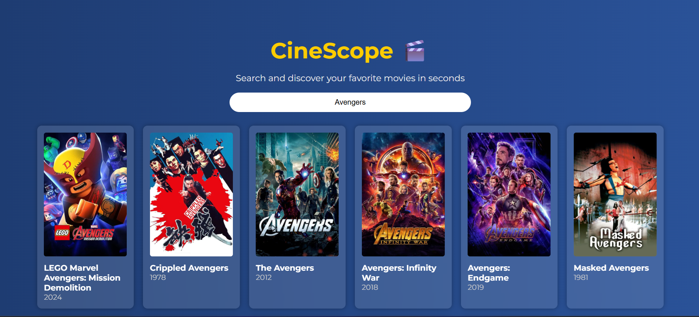

# 🎬 CineScope

**CineScope** is a sleek and modern movie search app powered by the [TMDB API](https://www.themoviedb.org/documentation/api). Search for your favorite movies and get quick details like posters, titles, and ratings in a visually engaging layout.

## 🔍 Features

- Real-time movie search using TMDB API
- Displays movie poster, title, release year, and rating
- Mobile-responsive design with clean UI
- Beautiful gradient background with animated cards

## 🚀 Demo

🔗 Live site: [Visit CineScope on Netlify](https://shiny-halva-ab148b.netlify.app/)

## 🛠️ Tech Stack

- HTML5
- CSS3 (with modern gradients and responsiveness)
- JavaScript (Vanilla)
- TMDB API for movie data

## 📸 Screenshot

